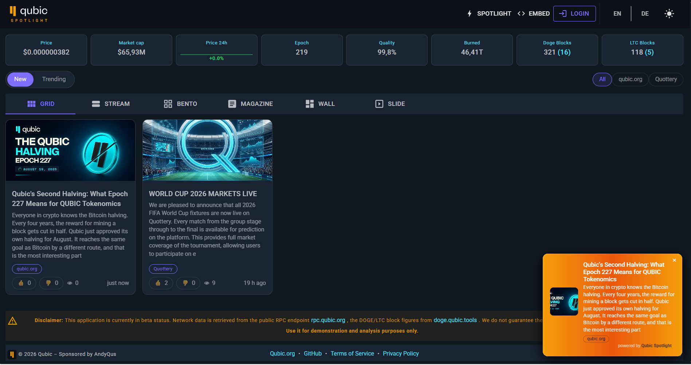

# Qubic Spotlight



Werbe- und Showcase-Plattform für das Qubic-Ökosystem. Zentral gepflegte Anzeigen
erscheinen auf einer öffentlichen Spotlight-Seite (inkl. Qubic-Netzwerk-Kennzahlen)
und lassen sich per kleinem Code-Snippet als Overlay-Banner in beliebige Webseiten
einbinden.

Stack: **.NET 10 Blazor Web App** (WebAssembly) · **MudBlazor** · **LiteDB** ·
REST-API mit **Swagger** · JWT + API-Key. Aufgebaut nach dem Muster von
`qubic_doge_stats`.

> 🇬🇧 English version: [readme.md](readme.md)

## Auslöser — warum Qubic Spotlight?

Das Qubic-Ökosystem lebt stark über **Discord**: dort werden Projekte vorgestellt,
es gibt viele Kanäle, Arbeitsgruppen und inzwischen auch Firmen und Produkte. Bei so
vielen Kanälen **verliert man jedoch leicht den Überblick** — Neuigkeiten gehen
unter, und wer nicht auf Discord ist oder länger offline war, bekommt sie gar nicht
mit.

Spotlight bündelt diese Neuigkeiten an einem Ort und macht sie überall sichtbar:

1. **Widget für Fremd-Webseiten** (die ursprüngliche Idee): eine Code-Zeile bindet
   die Neuigkeiten des Ökosystems als Banner/Overlay auf beliebigen Seiten ein —
   alle machen mit, jeder profitiert.
2. **Eigene öffentliche Spotlight-Seite**, die alle Neuigkeiten in mehreren Layouts
   (Grid, Stream, Bento, Magazin, Wall, Slide) zeigt — mit Bewertung (👍/👎),
   Sortierung (neu/top) und Filter nach Ecosystem-Gruppe.

Teams und Produkt-Betreiber pflegen ihre Anzeigen selbst — **direkt im Portal oder
über die API** aus ihren eigenen Anwendungen (anlegen, ändern, löschen).

Diese Webanwendung stelle ich dem Marketing-Team **kostenfrei** zur Verfügung.

## Projektstruktur

```
qubic_spotlight/            Server (ASP.NET Core, API, LiteDB, Auth, Worker)
qubic_spotlight.Client/     Blazor WASM (Spotlight-Seite, Admin-UI)
Shared/                     gemeinsame Models & DTOs
docs/                       Konzept + Branding (Logo)
Dockerfile, docker-compose.yaml
```

## Lokal starten

```bash
dotnet run --project qubic_spotlight
```

Dann `http://localhost:5080` öffnen. Beim ersten Start wird automatisch ein Admin
angelegt (Standard `admin@qubic.local` / `changeme`, über Umgebungsvariablen
`ADMIN_EMAIL` / `ADMIN_PASSWORD` änderbar). Login oben rechts → „Anzeigen".

Swagger-UI: `http://localhost:5080/swagger`

## Adminbereich — Funktionsumfang & Rollen

Der Login (oben rechts) führt in den geschützten Bereich. Welche Tabs und Aktionen
sichtbar sind, hängt von der Rolle des Benutzers ab.

### Rollen & Rechte

| Rolle | Anzeigen | Limit aktive Anzeigen | Priorität / „Pin" | Statistik | Benutzerverwaltung |
|-------|----------|-----------------------|-------------------|-----------|--------------------|
| **Admin** | alle anlegen / ändern / löschen | **unbegrenzt** | ✅ | ✅ | ✅ (Benutzer & Rollen, API-Keys) |
| **Marketing** | alle anlegen / ändern / löschen | **unbegrenzt** | ✅ | ✅ | ❌ |
| **Ecosystem** | nur **eigene** anlegen / ändern / löschen | **max. 5 aktive** | ❌ | ❌ | ❌ |

*Admin + Marketing zusammen bilden den „Manager" — dürfen alles ohne Limit.
Ecosystem-Partner werden beim Anlegen automatisch fest auf ihre eigene
Ecosystem-Gruppe gesetzt und sehen/bearbeiten nur ihre eigenen Anzeigen.*

### Wie viele Anzeigen dürfen angelegt werden?

- **Ecosystem:** maximal **5 gleichzeitig aktive** Anzeigen. Inaktive oder
  abgelaufene Anzeigen zählen nicht mit. Beim Anlegen oder beim Aktivieren einer
  6. aktiven Anzeige bricht der Vorgang mit einem Hinweis ab. Das Limit ist zentral
  in `SpotlightLimits.MaxActiveAdsPerOwner` (Standard **5**) konfiguriert.
- **Admin / Marketing:** kein Limit.

### Tabs im Adminbereich

- **Anzeigen** (alle Rollen): *Aktiv* · *Abgelaufen* · **Statistik**
  (Klicks / Einblendungen / 👍👎 pro Zeitraum — nur Manager).
- **Benutzer** (nur Admin): Benutzer anlegen / bearbeiten / löschen, Rollen &
  Ecosystem-Gruppe zuweisen, API-Keys (neu) erzeugen.
- **Embed** (alle Rollen): Snippet-Generator mit Live-Vorschau + Copy-Button.
- **Account** (alle): eigenes Passwort ändern, eigenen API-Key (neu) erzeugen
  (nur maskierte Vorschau, der volle Key wird einmalig bei der Erzeugung gezeigt).

### Priorisierung („Pin", nur Admin/Marketing)

Eine Anzeige kann für ein Zeitfenster als bevorzugt markiert werden; sie übernimmt
dann ab Aktivierung für eine einstellbare Dauer (`PriorityMinutes`, Standard 30 Min.)
global das Widget, danach rotieren die Anzeigen wieder normal.

## API (Auszug)

Öffentlich:
- `GET /api/ads` – aktive Anzeigen (fürs Widget/Dashboard)
- `GET /api/feed` – sortierter Anzeigen-Feed (`sort=new|top`, optional `ecosystem`)
- `GET /api/feed/ecosystems` – verfügbare Ecosystem-Gruppen (für den Feed-Filter)
- `POST /api/ads/{id}/vote` – Anzeige bewerten (👍/👎)
- `GET /api/ads/{id}/click` – zählt Klick + leitet weiter
- `POST /api/ads/{id}/impression` – zählt Einblendung
- `GET /api/qubic/stats` – Qubic-Netzwerk-Kennzahlen (gecacht)
- `GET /api/qubic/blocks` – DOGE/LTC-Block-Kennzahlen des Mining-Pools (gecacht)
- `GET /api/qubic/price-history` – Qubic-Kurs der letzten 24h (für den Chart)

Authentifiziert (Header `Authorization: Bearer <jwt>` **oder** `X-Api-Key: <key>`):
- `GET /api/my/me` – Profil des angemeldeten Benutzers
- `POST /api/my/password` – eigenes Passwort ändern
- `GET|POST /api/my/ads`, `PUT|DELETE /api/my/ads/{id}` – eigene Anzeigen
- `POST /api/my/apikey` – eigenen API-Key (neu) erzeugen
- `POST /api/uploads` – Bild hochladen (≤ 500 KB, PNG/JPG/SVG/WebP)
- `POST /api/auth/login` – Login → JWT

Verwaltung:
- `/api/admin/ads` (Admin + Marketing) – alle Anzeigen + `GET /api/admin/ads/stats`
- `/api/admin/users` (nur Admin) – Benutzerverwaltung + API-Keys

## Einbinden auf Fremd-Webseiten

```html
<script src="https://DEIN-HOST/spotlight.js"
        data-mode="slide-panel"   <!-- slide-panel | edge-marquee | corner-card -->
        data-position="right"      <!-- right | left | bottom | top -->
        data-interval="5000"
        data-theme="auto"
        data-max="10"
        data-closable="true"
        async></script>
```

Das Widget rendert sich im Shadow DOM als eigene Ebene (`position:fixed`) und greift
nicht ins Layout der Fremdseite ein. Das fertige Snippet gibt es auch im Admin unter
„Embed" (mit Konfigurations-UI + Copy-Button).

## Docker / Veröffentlichung

```bash
docker build -t andyqus/qubic_spotlight:latest .
docker push andyqus/qubic_spotlight:latest
```

Auf dem Server (siehe `docker-compose.yaml`) vor dem ersten Start setzen:
`JWT_SECRET` (langes Zufallsgeheimnis), `ADMIN_EMAIL`, `ADMIN_PASSWORD`. Daten
(LiteDB-Datei + Uploads) liegen im Volume unter `/data`.

### Deployment für Admins (Docker)

Die Geheimnisse landen **nicht** im Image oder im Repo, sondern in einer `.env`-Datei,
die ausschließlich auf dem Server liegt. Ablauf:

**1. Image laden**

```bash
docker pull andyqus/qubic_spotlight:latest
```

(Alternativ selbst bauen: `docker build -t andyqus/qubic_spotlight:latest .`)

**2. `docker-compose.yaml` + `.env.example` auf den Server legen**

Beide Dateien liegen im Repo und müssen im selben Verzeichnis auf dem Server liegen.

**3. Secrets eintragen** – `.env` aus der Vorlage erzeugen und befüllen:

```bash
cp .env.example .env
```

```env
JWT_SECRET=<langes Zufallsgeheimnis, min. 32 Zeichen>
ADMIN_EMAIL=admin@qubic.org
ADMIN_PASSWORD=<sicheres Startpasswort>
```

`JWT_SECRET` z. B. erzeugen mit `openssl rand -base64 48`.

**4. Starten**

```bash
docker compose up -d
```

Compose liest die `.env` automatisch ein und reicht die Werte als Umgebungsvariablen
in den Container.

**Wichtig für den Betrieb:**

- Die echte `.env` gehört **nicht ins Git** (steht in `.gitignore`); nur `.env.example`
  ist eingecheckt.
- **Fail-fast:** `JWT_SECRET` und `ADMIN_PASSWORD` sind in der Compose-Datei mit `:?`
  markiert – fehlt ein Wert, **bricht der Start mit Fehlermeldung ab** (Absicht).
- **Persistente Daten** liegen im Volume-Mount `/root/spotlight/data` → `/data`. Pfad
  ggf. ans System anpassen (Zeile 18 der Compose-Datei) und sichern.
- Die App lauscht im Container auf Port `8080` (auf Host `8080` gemappt). Davor gehört
  ein Reverse-Proxy (z. B. Caddy/Nginx) für HTTPS – im Repo liegt eine
  `Caddy.Dockerfile` als Ausgangspunkt.
- `ADMIN_EMAIL` / `ADMIN_PASSWORD` wirken **nur beim allerersten Start** (solange die DB
  leer ist). Spätere Änderungen daran haben keinen Effekt – das Passwort wird dann über
  die App geändert.

## Konfiguration (Umgebungsvariablen)

| Variable | Zweck | Default |
|----------|-------|---------|
| `JWT_SECRET` | Signatur der JWTs (min. 32 Zeichen) | dev-Fallback |
| `ADMIN_EMAIL` / `ADMIN_PASSWORD` | Initial-Admin beim ersten Start | admin@qubic.local / changeme |
| `DATA_DIR` | Ablage für DB + Uploads | (lokal: wwwroot) |
| `LITEDB_FILE` | Name der DB-Datei | spotlight.db |

## Hinweise

- Tracking ist DSGVO-arm: nur gehashte IP, kein Klartext, kein externes Tracking.
  Bewertungen (👍/👎) nutzen eine anonyme, im Browser erzeugte Kennung (kein Login nötig).
- API-Keys werden **nicht im Klartext** gespeichert (nur SHA-256-Hash + letzte 4 Zeichen
  für die maskierte Vorschau). Der volle Key wird ausschließlich einmalig bei der
  Erzeugung zurückgegeben.
- Freigabe-Workflow (`Status`) ist im Modell vorbereitet, in v1 aber inaktiv
  (alle Anzeigen sofort sichtbar).
- Paketversionen (MudBlazor 9.2.0, LiteDB 5.0.21, JwtBearer/WASM 10.0.5,
  Swashbuckle 7.2.0) ggf. per `dotnet restore` an die Umgebung anpassen.
